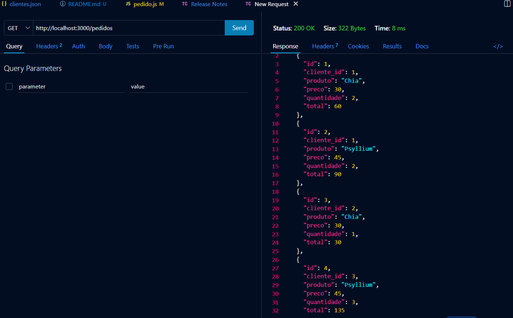
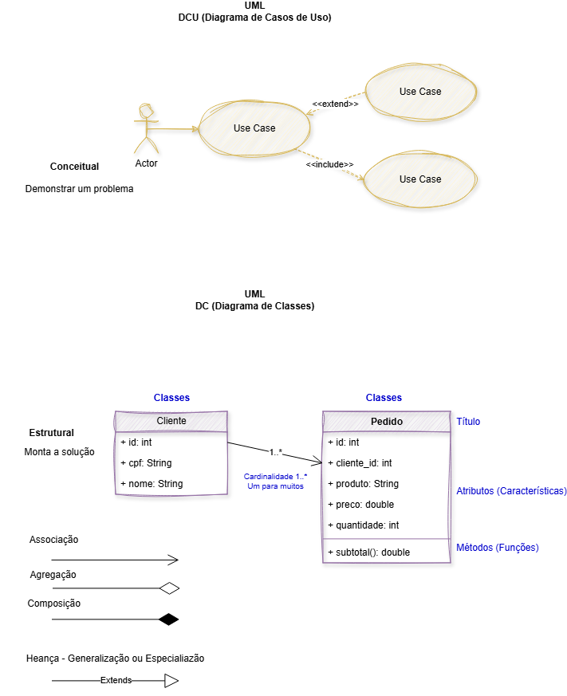

# Pedidos Classes

Projeto desenvolvido para praticar uma API em Node.js com Express, utilizando um CRUD de pedidos.

## Tecnologias utilizadas

* Node.js
* Express
* JavaScript
* JSON
* Thunder Client
* Git e GitHub

## Como executar

Primeiro, instale as dependências:

```bash
npm install
```

Depois, execute o servidor:

```bash
node server.js
```

O servidor ficará disponível em:

```text
http://localhost:3000
```

## CRUD de pedidos

O projeto possui operações para:

* Criar pedidos
* Listar pedidos
* Alterar pedidos
* Excluir pedidos

## Função calcTotais

Foi criada a função `calcTotais` para calcular o total de cada pedido.

O cálculo é feito multiplicando a quantidade pelo preço:

```text
total = quantidade × preço
```

A função é chamada dentro da função `listar`, fazendo com que o total seja calculado antes de mostrar os pedidos.

## Teste no Thunder Client

Foi realizado um teste utilizando o método `GET` para listar os pedidos e verificar o cálculo do total.




## Draw IO


## Resultado

O campo `total` aparece na resposta da API com o valor calculado de acordo com a quantidade e o preço de cada pedido.

## Autor

Victor Alves
